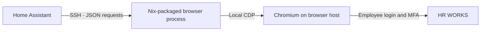

# HR WORKS for Home Assistant

Your working-time balance and leave calendar, alongside the rest of your home.
Uses your **regular employee login and authenticator**. No company API key is needed.

## What you get

| Entities | Details |
| --- | --- |
| Time account | Worked and target hours, monthly balance, carryover and total balance |
| Daily time | Credited work, target and balance where the portal exposes them |
| Vacation | Available and approved days |
| Calendars | Leave and sickness, with approval status and half-day annotations |
| Status | Clocked in, on leave and on sick leave |
| Controls | Refresh button and a working-time action with a preview mode |

One service device per employee. English and German translations. Numeric hours for
graphs and calculations, with a readable `formatted` attribute such as `-1:30`.
Different employees can have their own entries, worker sessions and settings.

## How it works



Home Assistant starts the browser process through `asyncssh`, using the same remote
command pattern as our Monero Pool integration. Requests and responses travel through
SSH stdin/stdout. Playwright and its driver run on the browser host; HA installs only
AsyncSSH. The worker creates isolated Chromium contexts and saves each employee's
cookies in a private state directory. It disconnects without closing other browser tabs.

## Declarative installation on NixOS

Add a pinned flake input and import its NixOS module:

```nix
# flake.nix inputs
hrworks = {
  url = "github:pschmitt/homeassistant-hrworks";
  inputs.nixpkgs.follows = "nixpkgs";
};
```

```nix
# Browser host module (inputs supplied through specialArgs)
{ inputs, ... }:
{
  imports = [ inputs.hrworks.nixosModules.default ];
  programs.hrworksWorker = {
    enable = true;
    cdpUrl = "http://127.0.0.1:9222";
    enableWrites = false;
  };
}
```

Commit `flake.lock` and deploy through your normal NixOS deployment workflow.
The module installs the executable with its Python and Playwright dependencies in
the Nix store. SSH starts the process on demand; it exits when the connection closes.
Chromium and SSH must already be configured on the browser host. The worker uses
`~/.local/state/hrworks-worker` under the SSH user by default; `stateDirectory`
can override it. Login cookies are runtime state and never go into the Nix store.

The fnuc deployment provides `hrworks-worker-browserless` and
`hrworks-worker-steel` as alternate remote worker commands. Select one in the
integration's **Remote worker command** field to compare the local Browserless
and Steel browser backends. The regular CLI also exposes the worker as
`hrworks worker`; Steel sessions are released when the command closes.

1. Add this repository as an **Integration** repository in HACS, or install
   `custom_components/hrworks` using your existing submodule and symlink workflow.
2. Restart HA and add **HR WORKS** under Settings → Devices & services.
3. Enter the SSH host, port and username, the key file path **inside HA**, and a
   verified `known_hosts` entry. The remote worker command defaults to `hrworks worker`;
   an absolute executable path is also supported.
4. Enter your employee company ID, user ID and password. If MFA is requested, a
   saved TOTP URI is tried automatically; enter a one-time code on the same form
   if needed. One-time codes are never stored.

Keep SSH private keys in runtime secret files (for example SOPS-managed files),
never in a flake or Nix string. The existing HA SSH key can be reused where authorized.
Employee passwords are stored in HA's config entry. Protect HA backups and the
browser user's state directory.

## Settings and repair

- **Reconfigure:** change the SSH connection, device name, company, username, password or TOTP URI. Blank secret fields keep the saved values; use **Remove saved TOTP URI** to clear it. Account changes preserve entity IDs and use a fresh login.
  A blank employee password keeps the existing value. Changing employees requires a new entry.
- **Options:** update interval (5 minutes–1 day), calendar history and lookahead
  (up to two years each), pending leave, sickness visibility and time-entry permissions.
- **Repairs:** expired employee sessions can be repaired on one form with the saved
  login, TOTP URI and an optional fresh authenticator code. Worker failures and portal
  changes have specific guidance.
- **Diagnostics:** contain metric names, counts and operational status; exclude
  credentials, company/user IDs, SSH addresses and host keys, event details and HR values.

The refresh button also retries after a worker outage. Successful updates clear the
relevant repairs. A calendar only covers the configured window; its `coverage`
attribute gives the exact bounds. Cancelled or rejected leave is never treated as
approved absence.

## Reporting periods

HR WORKS may expose the newest available month before it creates an account for
the current month. Every time-account sensor includes `period`, `current_month`
and `balance_basis`. The latest previous month is labelled as such, never silently
presented as the current month.

Balances come from the detailed account, including leave deductions and corrections.
The current month's “to the previous day” balance takes precedence when exposed.
Missing or unparseable values are **unavailable**, never synthesized as zero.

Half-day leave stays an all-day calendar entry with a half-day description. No artificial clock times are invented for an absence.

## Enter working times

`hrworks.record_working_time` handles **one completed interval**. Include an explicit
timezone offset, and send separate calls for morning and afternoon work.

```yaml
action: hrworks.record_working_time
data:
  start: "2026-10-02T08:30:00+02:00"
  end: "2026-10-02T12:00:00+02:00"
  type: working_time
  comment: "Morning work"
  dry_run: true
response_variable: preview
```

Previews validate the interval and inspect existing entries without adding an entry.
To save, enable time entry in the integration options **and** set `programs.hrworksWorker.enableWrites = true` on the browser host, then explicitly set `dry_run: false`. Writes are disabled by default.
The action refuses incomplete, future, overlapping, or cross-midnight intervals.
Use minute precision: seconds are rejected rather than silently rounded.
Supported types include ordinary work, doctor appointments, business errands and training.
Available types and edit permissions still depend on your employer's portal configuration.

A successful save is checked by reopening the day. An uncertain result raises a
repair; check HR WORKS before resubmitting. Neither the worker nor HA automatically
retries a write after a timeout. No historical gaps are automatically filled.

## Dashboard

An example using native tiles, a balance graph and calendars is in
[`examples/dashboard.yaml`](examples/dashboard.yaml). Adjust entity IDs to your device name.
The dashboard needs no custom frontend cards.

## Updating

Update the integration and worker together. Update the pinned flake input and deploy the resulting NixOS configuration.
Employee sessions are preserved in the runtime state directory. HACS updates the HA portion only.

This is an independently maintained custom integration. HR WORKS does not provide
or support the browser protocol used here. Portal layout changes may require a
worker update. This integration does not create leave or sickness requests.

## Authentication and maintenance

An optional `otpauth://totp/...` provisioning URI can be entered during account
setup, Reconfigure, or an MFA challenge in Repairs. Use the URI behind your
authenticator’s QR code. Six-digit SHA1, SHA256 and SHA512 TOTP URIs are accepted.
The seed is stored alongside the employee password in Home Assistant, never
prefilled into forms, included in diagnostics, or sent to the browser worker.
Only the generated one-time code crosses SSH. Protect Home Assistant backups
as you would your password manager.

With a URI saved, an expired session gets one fresh login and one snapshot retry.
If the portal rejects the generated code, the login form stays open for a manual
code or an updated URI. A browser or connection failure discards the failed worker session.
Home Assistant retries the snapshot once immediately, then polls every minute
while those failures persist. Successful updates restore the configured polling
interval and clear the worker repair. Working-time submissions are never
automatically replayed; a browser failure during a submission is reported as
uncertain so you can check the recorded times before trying again.

The adapter discovers year/month options, follows navigation links, reads editor
controls through their labels, and discovers working-time choices by displayed
labels rather than option IDs. Label whitespace, trailing colons, typographic
apostrophes and regenerated control IDs are tolerated. English and German labels
are supported. Unknown meanings, ambiguous rows and changed structural containers
fail visibly through Repairs rather than guessing or publishing fabricated data.

Browser integration remains dependent on HR WORKS’ private portal layout. It
cannot offer the stability of an official API. Synthetic browser fixtures cover
editor layout variations; authentication and coordinator regression tests run
against Home Assistant itself. All fixtures use invented data.

## Python CLI and shared library

The integration now bundles the same independent Python client used by the
`hrworks` / `hr-works` CLI. The default output is colorful, aligned TSV in a
terminal and literal TSV in pipes. `--json` produces one clean JSON document.

```bash
uv tool install git+https://github.com/pschmitt/homeassistant-hrworks.git
hrworks --help
```

One-shot execution is supported with
`uvx --from git+https://github.com/pschmitt/homeassistant-hrworks.git hrworks --help`.
Nix installs the CLI alongside the configured worker. Read the
[CLI guide](docs/cli.md) for every subcommand, rbw/SSH setup, calendars, CSV imports,
private secrets and shell completions, or the [Python guide](docs/python.md) to
use the shared library directly.


### CLI caching

Reads persist in `$XDG_CACHE_HOME/hrworks/reads.sqlite3` (normally
`~/.cache/hrworks/reads.sqlite3`). The directory is private (`0700`), the database
is `0600`, and profiles/accounts/endpoints have separate cache keys. The cache
contains personal HR data; credentials, TOTP seeds and cookies are not cached.
`HRWORKS_CACHE_DIR` overrides its directory.

| Data | Default freshness |
|---|---|
| Today, balance, status, snapshots and calendar reads | 60 seconds |
| Other days within the last 31 days | 15 minutes |
| Older days | 24 hours |
| Future days | 5 minutes |
| Any day with an open interval | At most 30 seconds |

Month listings reuse individual cached days. `--no-cache`, `--nocache` and `-N`
fetch live data and refresh the cache; they work before or after subcommands.
`--cache-ttl SECONDS` or `HRWORKS_CACHE_TTL` overrides freshness, with `0` bypassing
caching. Open intervals retain their 30-second limit. Expired data is never used
as an offline fallback. Doctor, authentication checks, previews and submissions
always contact the worker.

Successful writes and uncertain submissions invalidate the affected day plus
balances and snapshots, preserving unrelated cached days. Partial imports
invalidate every attempted day. Invalidation before and after writes also prevents
an overlapping read from repopulating obsolete data. Login, logout and profile
changes clear the current profile's cached data. Writes by other tools, including
Home Assistant or the HR WORKS website, become visible when the TTL expires;
use `-N` for an immediate refresh.

```bash
hrworks times list                  # Reuse this month's fresh cached days.
hrworks times list -N               # Fetch and refresh every requested day.
hrworks balance --cache-ttl 30       # Require data no older than 30 seconds.
hrworks cache clear                 # Clear this profile.
hrworks cache clear --all-profiles  # Clear all cached profiles.
```
